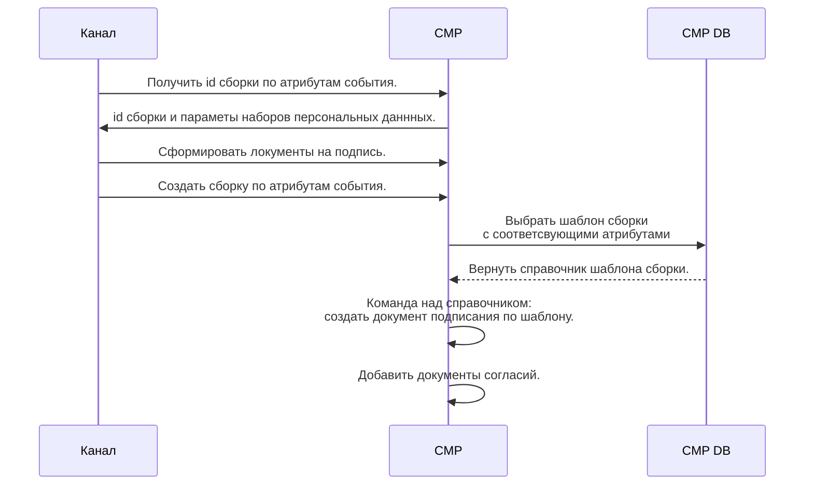

```mermaid
sequenceDiagram
    participant ch as Канал
    participant cmp as CMP
    participant db as CMP DB
    
    ch ->> cmp: Получить id сборки по атрибутам события.
    cmp ->> ch: id сборки и параметы наборов персональных даннных.
    ch ->> cmp: Сформировать локументы на подпись.
    ch ->> cmp: Создать сборку по атрибутам события.
    cmp ->> db: Выбрать шаблон сборки<br/>с соответсвующими атрибутами
    db -->> cmp: Вернуть справочник шаблона сборки.
    cmp ->> cmp: Команда над справочником:<br/>создать документ подписания по шаблону.
    cmp ->> cmp: Добавить документы согласий.

```