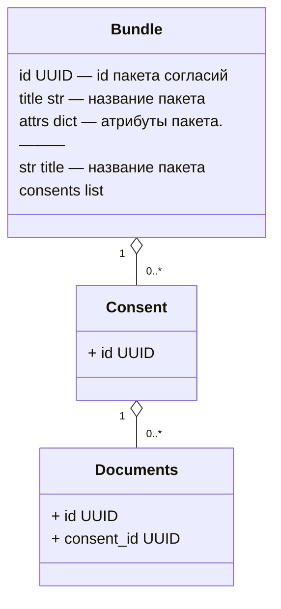

# class\_diagram

```mermaid
classDiagram
    
    class Bundle {
        id UUID — id пакета согласий
        title str — название пакета
        attrs dict — атрибуты пакета. 
        ———
        str title — название пакета
        consents list
    }
    
    class Consent{
        + id UUID
    }
    
    class Documents{
        + id UUID
        + consent_id UUID
    }
    Bundle "1" o-- "0..*" Consent
    Consent "1" o-- "0..*" Documents
```

```mermaid
classDiagram
    
    class Bundle {
        id UUID — id пакета согласий
        title str — название пакета
        attrs dict — атрибуты пакета. 
        ———
        str title — название пакета
        consents list
    }
    
    class Consent{
        + id UUID
    }
    
    class Documents{
        + id UUID
        + consent_id UUID
    }
    Bundle "1" o-- "0..*" Consent
    Consent "1" o-- "0..*" Documents
```
