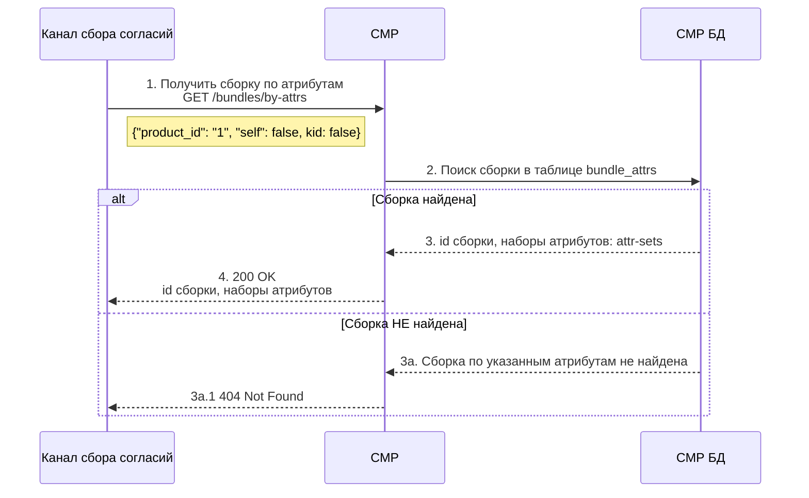

# Получить наборы атрибутов клиента для заполнения согласий

## Описание сценария

| Параметр        | Значение                                                           |
|:----------------|:-------------------------------------------------------------------|
| Название:       | Получить наборы атрибутов клиента для заполенния согласий.         |
| Цель:           | Получить наборы атрибутов клиента для заполенния согласий.         |
| Предусловие:    | В канале произошло событие .                                       |
| Триггер:        | В канале сбора согласий возникла необходимость подписать согласия. |
| Инициатор:      | Канал сбора согласий (ЛК, 1С:УСК).                                 |
| Последствия:    |                                                                    |
| Бизнес правила: |                                                                    |

## Диаграмма

## Основной поток:

**Триггер:** Канал в параметрах полиса определил признак необходимости сбора согласия.

(1) Канал вызывает в СМР метод `GET /bundles/by-attrs&=<attr 1>=<value 1>&`

(2) СМР выбирает в таблице `bundle_attrs` сборку у которой набор атрибутов
полностью совпадет с набором переданным в запросе.

(3) СМР БД возвращает id сборки. **EXT**

(4) Канал получает список наборов атрибутов `attr_sets`
необходимых для подписания всех согласий в сборке.

### Расширения

(3a) По указанным в запросе атрибутам сборка НЕ найдена

(3а.1) CPM возвращает 404 Not Found