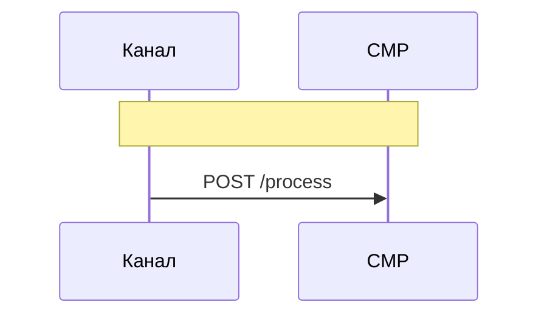

# Сформировать согласие пользователя





```json
{
  "userId":
  "bundleId":
  userData{
    "id": 12345,
    "name": "Иван Иванов",
    "email": "ivan@example.com",
    "preferences": {
      "theme": "dark",
      "notifications": true
    }
  },
  "status": "active"
}
```